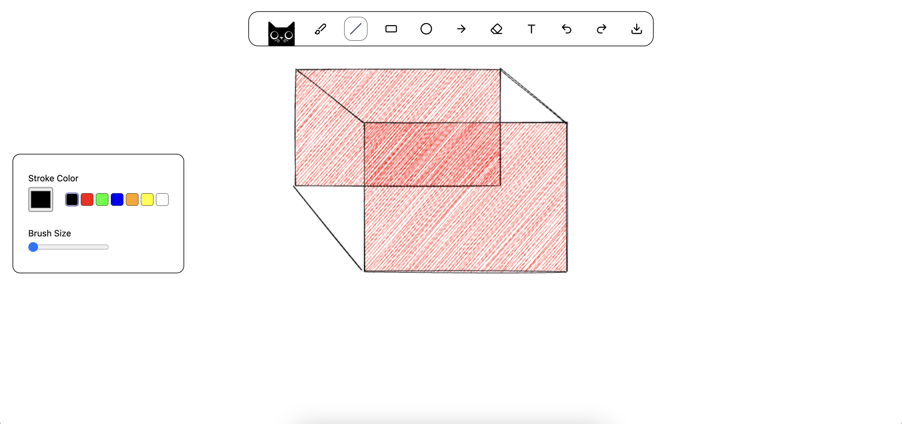

# Whiteboard

A collaborative whiteboard application built with React and Canvas API, featuring multiple drawing tools and real-time editing capabilities.



## Features

- **Multiple Drawing Tools**: Brush, Line, Rectangle, Circle, Arrow, Text, and Eraser
- **Customizable Styling**: Adjust stroke color, fill color, and size for each tool
- **Undo/Redo**: Full history management with keyboard shortcuts (Ctrl/Cmd+Z, Ctrl/Cmd+Y)
- **Live Text Editing**: Real-time text input with synchronized styling
- **Hand-drawn Aesthetics**: Beautiful sketchy look using RoughJS
- **Smooth Brush Strokes**: Natural drawing experience with Perfect Freehand

## Tech Stack

- **React 19** - UI framework
- **Canvas API** - Drawing surface
- **RoughJS** - Hand-drawn style graphics
- **Perfect Freehand** - Smooth brush strokes
- **Vite** - Build tool
- **Tailwind CSS** - Styling

## Getting Started

### Installation

```bash
npm install
```

### Development

```bash
npm run dev
```

### Build

```bash
npm run build
```

## Usage

1. Select a tool from the toolbar
2. Customize stroke color, fill color, and size from the toolbox
3. Click and drag on the canvas to draw
4. Use the eraser tool to remove elements
5. Use Ctrl/Cmd+Z to undo and Ctrl/Cmd+Y to redo

## Project Structure

```
src/
├── components/
│   ├── Board/          # Main canvas component
│   ├── Toolbar/        # Tool selection
│   └── Toolbox/        # Style customization
├── store/              # Context-based state management
├── utils/              # Helper functions
└── constants.js        # App constants
```

## License

MIT
