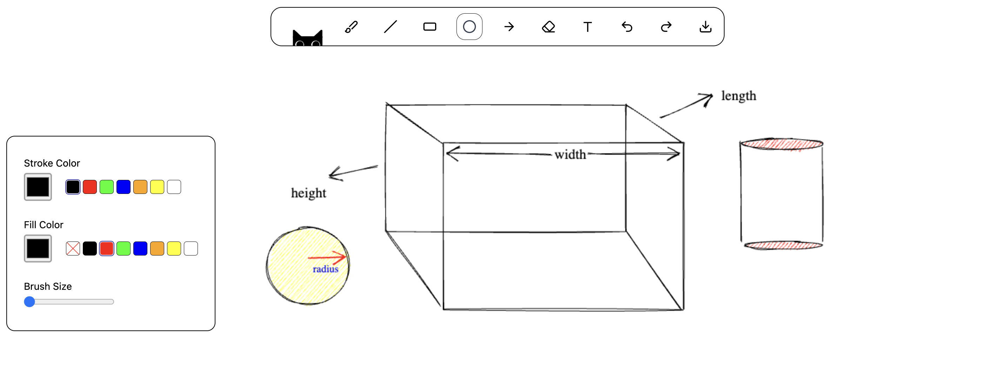
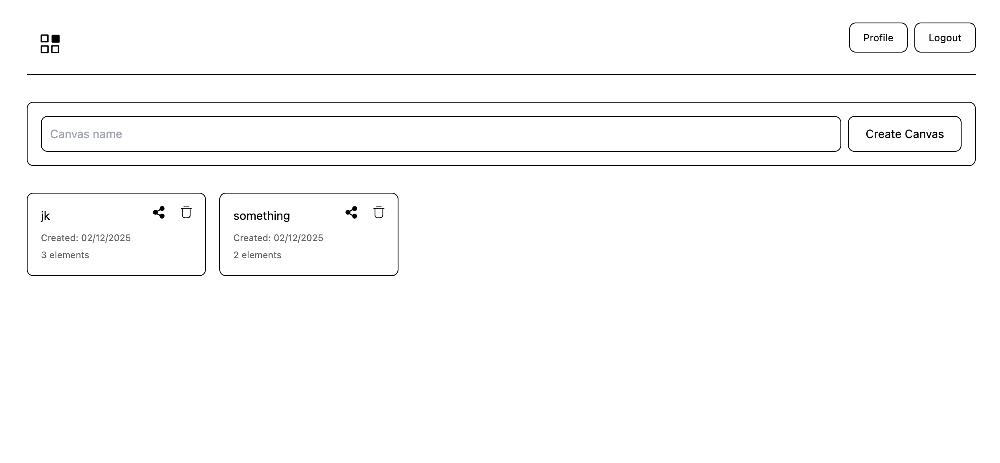
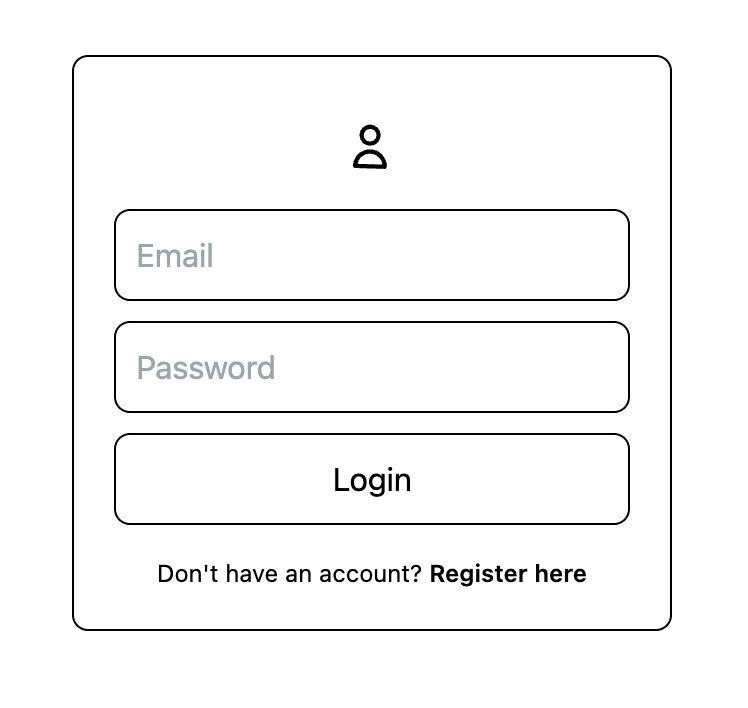
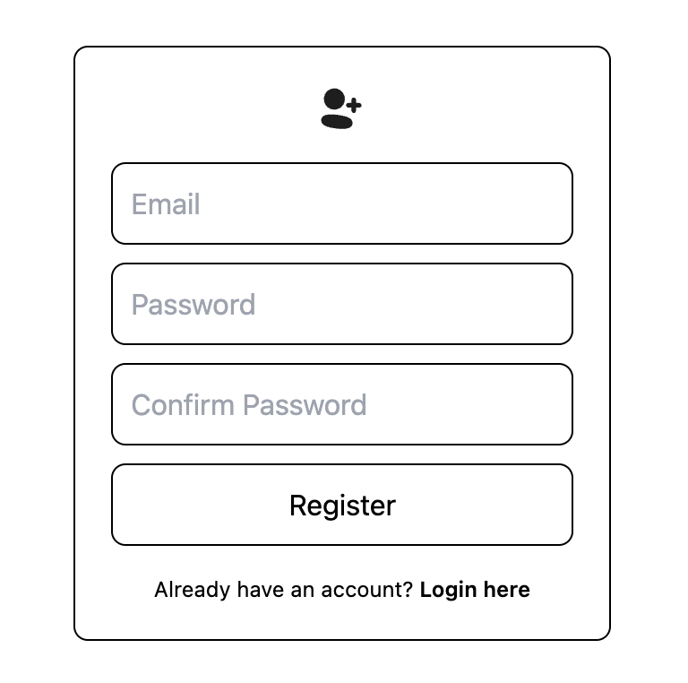

# Whiteboard

A full-stack collaborative whiteboard application with persistent storage, user authentication, and real-time canvas management.





<p align="center">
  
  
</p>

## Architecture

**Frontend**: React 19 with Canvas API  
**Backend**: Node.js + Express + MongoDB  
**Deployment**: Vercel (Frontend) + Render (Backend)

## Core Features

**Drawing Tools**  
Brush, Line, Rectangle, Circle, Arrow, Text, Eraser with customizable stroke, fill, and size properties.

**Canvas Management**  
Create multiple canvases, persist drawings to database, share with other users via email.

**Authentication**  
JWT-based user registration and login with bcrypt password encryption.

**History Control**  
Undo/Redo functionality with full state management.

**Visual Design**  
Hand-drawn aesthetics using RoughJS, smooth brush strokes via Perfect Freehand.

## Tech Stack

### Frontend

- React 19
- Canvas API
- RoughJS
- Perfect Freehand
- React Router DOM
- Tailwind CSS
- Vite

### Backend

- Node.js
- Express
- MongoDB + Mongoose
- JWT Authentication
- bcrypt

## Project Structure

```
whiteboard/
├── src/
│   ├── components/
│   │   ├── Board/          # Canvas rendering and drawing logic
│   │   ├── Toolbar/        # Tool selection interface
│   │   ├── Toolbox/        # Style customization panel
│   │   ├── Dashboard/      # Canvas management
│   │   ├── Login/          # Authentication
│   │   ├── Register/       # User registration
│   │   └── Profile/        # User profile
│   ├── store/              # Context-based state management
│   ├── utils/              # API calls and helper functions
│   └── constants.js        # Application constants

whiteboard-backend/
├── controllers/            # Request handlers
├── models/                 # MongoDB schemas
├── routes/                 # API endpoints
├── middlewares/            # JWT authentication
└── db.js                   # Database connection
```

## API Endpoints

### Users

```
POST   /api/users/register
POST   /api/users/login
GET    /api/users/profile
```

### Canvas

```
GET    /api/canvas
POST   /api/canvas
GET    /api/canvas/load/:id
PUT    /api/canvas/update/:id
DELETE /api/canvas/delete/:id
PUT    /api/canvas/share/:id
```

## Setup

### Frontend

```bash
cd whiteboard
npm install
npm run dev
```

### Backend

```bash
cd whiteboard-backend
npm install
npm run dev
```

### Environment Variables

**Frontend** (.env)

```
VITE_API_URL=your_backend_url
```

**Backend** (.env)

```
MONGO_URI=your_mongodb_uri
JWT_SECRET=your_jwt_secret
CLIENT_URI=your_frontend_url
```

## License

MIT
